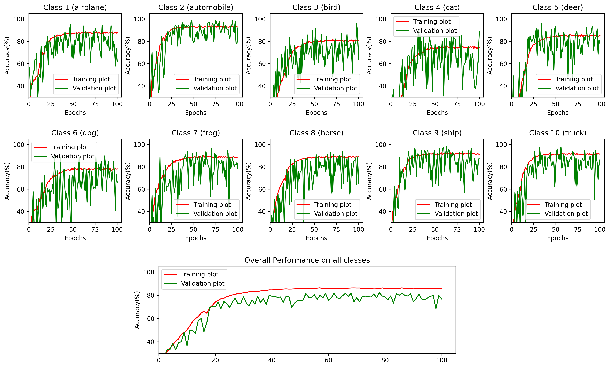

# ML-Problem-CDS

A repository for ML problem and its solution @CDS

## Problem Statement:

- **Goal**: Build a machine learning model and deploy it.
- **Task**: Develop a machine learning model (image classification) based on provided data and deploy it as a simple web application or API.
- **Output**: A GitHub repository with code, usage documentation and a live demo (could be a simple web page).
- **Evaluation**: Performance of the model, code quality, and usability of the deployment.

- **Data**: https://www.cs.toronto.edu/~kriz/cifar.html (use the CIFAR-10 version)

## CIFAR-10 with Neural Networks and FLASK Deployment

This is a multi-class image classification problem, which is being solved using both dense neural networks and convolutional neural networks. The best trained model will be deployed using the Flask framework.

1. [ DATASET ](#DATASET)
2. [ Deep Learning - Neural Networks ](#DeepLearning)
3. [ FLASK ](#FLASK)
4. [ How to Run ](#HowtoRun)

<a name="DATASET"></a>

## 1. DATASET

The [CIFAR-10](https://www.cs.toronto.edu/~kriz/cifar.html) dataset consists of 60000 32x32 colour images in 10 classes, with 6000 images per class. There are 50000 training images and 10000 test images.

<p align="center">

</p>
https://www.cs.toronto.edu/~kriz/cifar-10-sample/cat5.png

<a name="DeepLearning"></a>

## 2. Deep Learning - Neural Networks

We considered dense neural networks (DNN) and convolutional neural networks (CNN), starting from simple to slightly more complex networks. We began with a baseline model for both types of networks and optimized them for network parameters, including the number of layers, filter size, and number of nodes, with the goal of keeping the model as simple as possible. Additionally, we utilized data augmentation and regularization techniques to reduce overfitting and make the model more robust.

- The optimizer chosen is Adam, with default parameters set.
- Dropout and Batch Normalization are added to prevent overfitting and achieve faster convergence.
- Data augmentation includes random transformations such as horizontal flipping, rotation, and color jitter.

- After the model training is finished, the DNN turns out to be overfitting, even after applying data augmentation and regularization. The best model achieved only nearly 53% accuracy on the validation set.
- The best CNN model achieved nearly 82% accuracy on the validation set compared to the baseline model. However, there was a slightly reduced performance on the validation set when using data augmentation and regularization with the baseline model. Nevertheless, it provided a more generalized and robust model.
- Since my intent was to keep the model as simple as possible, a more complex network with more parameters could be used with other tweaks to improve the validation performance up to 90%.

- Performance curve from CNN model training:



<a name="FLASK"></a>

## 3. FLASK

Flask is a micro web framework for Python used to build web applications. It provides tools, libraries, and support for creating web applications quickly and efficiently. Flask is lightweight, flexible, and easy to learn, making it a popular choice for developers.

- The baseline CNN model is deployed using Flask, allowing users to upload an image and view the predicted class generated by the model.

<a name="HowtoRun"></a>

## 4. How to Run

1. Fork this repository.

```console
$ git clone https://github.com/Nikhil-2797/ML-Problem-CDS.git

```

2. Create new virtual envirnment with python 3.10 and Load the dependencies of the project

```console
conda create -p venv python==3.10 -y
pip install -r requirements.txt
```

3. Due to the unavailability of a local GPU card, models were trained on Google Colab. Both Python scripts and .ipynb notebooks are included in the project repository.

4. Run flask server locally

- To run locally either run from the IDE or use the following command:

```bash
python app.py
```

- Open your web browser and visit `http://localhost:3000`
- Select an image and click on the `Predict Image` button
